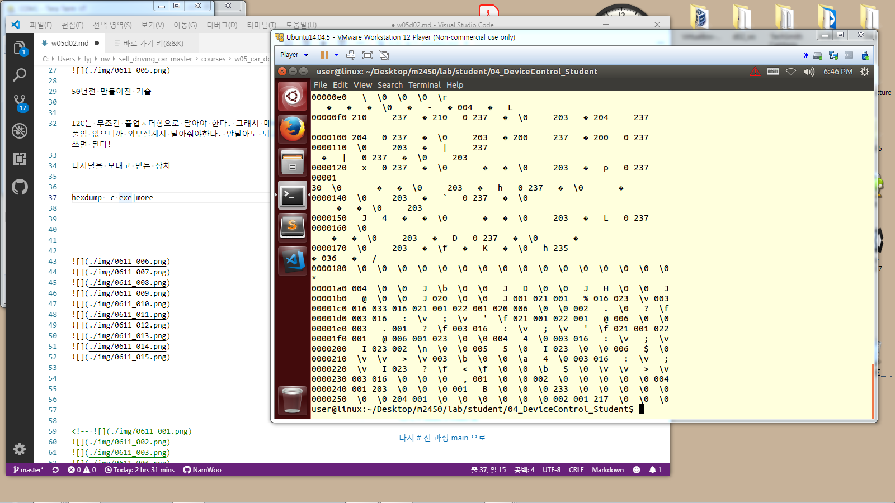

***5주차 2일짜 20190611 수업***

***20190611 마지막업데이트***

# Week 5 - Day 2 - 차량용 프로세서 디바이스 제어

## pull-up and pull-down

<!--  -->

풀업, 풀다운 설정 하는 레지스터 있는지 확인.

GPE14 찾았고 I2C 로 쓰려면 비트 10으로 ***얼터네이티브 펑션 제3의 기능*** 

## UART

rs232c 트렌시버

50년전 만들어진 기술

I2C는 무조건 풀업ㅈ더항으로 달아야 한다. 그래서 메뉴얼보고 회로도 보고 풀업 없으니까 외부설계시 달아줘야한다. 안달아도 되고 이미 있다면 믿고 쓰면 된다!

디지털을 보내고 받는 장치

`hexdump -C exception.o |more`

'\n' (줄바꿈) 0x0a 개행 

동조

BPS 1초에 몇번을 보내는, 115,200bps 다 하면 초당 115200 bit를 보내는 속도

비동기 
* 한줄로 보내는, 시작비트와 정지비트로 싱크를 맞추는게

동기
* 두줄로 보내는, 동기는 IIC 클럭과 data로 나눠서 

<!-- 

 -->

---
[다시 # week 5 index 로](../w05.md)

[다시 # 전 과정 main 으로](../../README.md)

